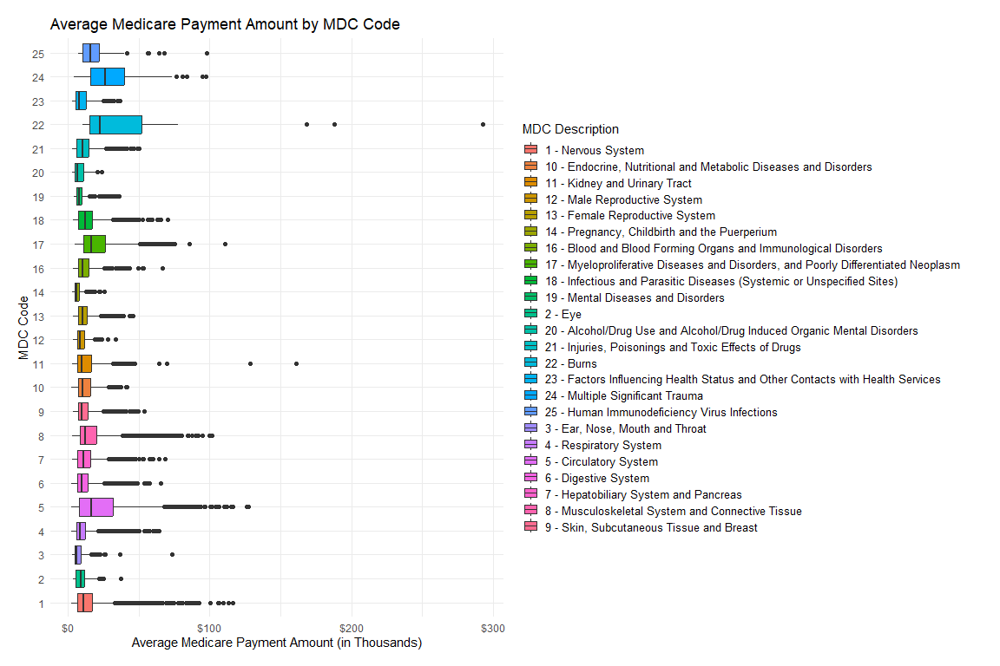

PM 566 Midterm
================
Stephanie Lee
2023-05-08

# Introduction

In recent years, Medicare spending has become a significant concern for
policymakers, as the program represents a substantial portion of the
federal budget. According to the Centers for Medicare and Medicaid
Services (CMS), in 2020, Medicare spending accounted for approximately
16% of the federal budget and totaled \$796.2 billion.

One area of particular concern is inpatient hospitalizations, which
represent a significant portion of Medicare spending. In 2018, Medicare
spent \$203.1 billion on inpatient hospitalizations, accounting for 40%
of all Medicare fee-for-service spending. Additionally, the average
Medicare payment for an inpatient hospitalization was \$14,219 in 2018,
with substantial variation across different geographic regions and
hospital types.

Given the high costs associated with Medicare inpatient
hospitalizations, it is essential to understand the patterns and trends
in healthcare utilization by Original Medicare Part A beneficiaries. The
Medicare Inpatient Hospitals by Geography and Service medicareset
provides a rich source of information for exploring the variation in
healthcare utilization and costs by geographic region and Medicare
Severity Diagnosis Related Group (DRG).

**Research Question:**

1.  How does Medicare inpatient hospitalization rates and payments vary
    by geographic region and Medicare Severity Diagnosis Related Group
    (DRG)?

**Follow-up Questions:**

2.  What are the specific DRG codes with the highest rates of Medicare
    inpatient hospitalizations, and how do they vary across different
    geographic regions?

3.  What factors contribute to the variation in Medicare payments for
    inpatient hospitalizations across different geographic regions and
    DRG codes?

# Methods

### Data Sources

The Medicare Inpatient Hospitals by Geography and Service dataset is a
critical source of information for understanding healthcare utilization
and spending among Original Medicare Part A beneficiaries. The dataset
is publicly accessible on the [CMS
website](https://data.cms.gov/provider-summary-by-type-of-service/medicare-inpatient-hospitals/medicare-inpatient-hospitals-by-geography-and-service)
and the version downloaded was the latest available from 2020. According
to CMS, the dataset is derived from the Medicare Provider Analysis and
Review (MedPAR) file, which contains information on hospital inpatient
stays for Medicare beneficiaries. The MedPAR data is then aggregated by
CMS into the Medicare Inpatient Hospital Discharge File (MIHDF), which
is the source of the Medicare Inpatient Hospitals by Geography and
Service dataset.

The MIHDF contains information on hospital discharges for Original
Medicare Part A beneficiaries by inpatient prospective payment system
(IPPS) hospitals. The dataset is organized by geography and Medicare
Severity Diagnosis Related Group (MS-DRG), a classification system used
to group patients with similar diagnoses and treatments. The dataset
includes information on the number of discharges, payments, and
submitted charges for each MS-DRG in each geographic area.

In addition to the DRG codes, the CMS Major Diagnostic Categories (MDCs)
are also included, also found on the [CMS MS-DRG Definitions
Manual](https://www.cms.gov/icd10m/version38-1-fullcode-cms/fullcode_cms/P0002.html).
MDCs group DRGs based on the diagnosis that led to the hospital
admission. The MDCs are broader categories than the DRGs and can provide
additional insights into the types of medical conditions that are most
commonly treated in hospitals.

For further information, CMS provides documentation for the following:

-   [Data collection
    methodology](Medicare%20Inpatient%20Hospitals%20Methodology%20(1).pdf)
-   [Variable Descriptions](MUP_INP_RY22_20220722_DD_Geo.pdf)
-   [Design and development of
    DRG](Design%20and%20development%20of%20the%20Diagnosis%20Related%20Group%20(DRG).pdf)

### Data Wrangling

After reading in data, checking the dimensions, headers, and footers,
and carefully checking for variable names and types. There are a total
of 9 variables and 26985 observations. The only missing values are
within the geographic code varaible. This is because the data aggregated
at the national level was given a value of ‘NA’ to distinguish from the
other observations collected at the state level. The observations are
categorized by state, with two additional regions: District of Columbia
and aggregated data at the national level. Though there are 752 distinct
diagnostic codes, there are only 735 diagnostic descriptions. For the
diagnostic descriptions with more than one diagnostic code, they seem to
be more vague like a certain type of procedure or containing the words
“or” or “other”. There are 17 total DRG descriptions assigned to more
than one code. I assume these diagnosis descriptions are most likely
further specified by the other diagnostic codes, which may be difficult
for a non-medical expert to discern or irrelevant for data analysis use.
Nevertheless, these descriptions only make up 3% of the observations in
the dataset. Overall, the dataset was already fairly usable and only
needed some variable data type changes, such as conversions of codes to
categorical variables. Furthermore, MDCs were also joined to the dataset
for broader diagnosis categories.

``` r
dim(cms)
head(cms)
tail(cms)

#Variables
str(cms)

dim(mdcs)
head(mdcs)
tail(mdcs)
```

``` r
#Take a closer look at the key variables
distinct(cms, `DRG_Cd`)
distinct(cms, `Rndrng_Prvdr_Geo_Cd`)
distinct(cms, `DRG_Desc`)
distinct(cms, `Rndrng_Prvdr_Geo_Desc`)
```

``` r
# Find DRG descriptions assigned to more than one code.
drgs <- distinct(cms,`DRG_Cd`,`DRG_Desc`)
drgs_dup <- drgs[duplicated(drgs$DRG_Desc),  ]
drgs_dup
```

``` r
# Count the occurrences of DRG descriptions assigned to more than one code
drgs_dup_vec <- drgs_dup$DRG_Desc
table(cms$DRG_Desc %in% drgs_dup_vec)
```

``` r
cms <- left_join(cms, select(mdcs, 'DRG_Cd','MDC', 'MDC_Desc'), by = 'DRG_Cd')

#Check missing values
summary(is.na(cms))
```

``` r
cms$Rndrng_Prvdr_Geo_Cd <- factor(cms$Rndrng_Prvdr_Geo_Cd)
cms$DRG_Cd <- factor(cms$DRG_Cd)
cms$MDC <- factor(cms$MDC)

#Remove NAs except for geo codes for the National Level (this is intentionally set to NA)
cms <- cms %>%
  filter(!is.na(MDC) & !is.na(MDC_Desc))
```

``` r
# Define region groups
Northeast <- c("Connecticut", "Maine", "Massachusetts", "New Hampshire", "Rhode Island", "Vermont", "New York", "New Jersey", "Pennsylvania")
South <- c("Delaware", "Florida", "Georgia", "Maryland", "North Carolina", "South Carolina", "Virginia", "District of Columbia", "West Virginia", "Alabama", "Kentucky", "Mississippi", "Tennessee", "Arkansas", "Louisiana", "Oklahoma", "Texas")
Midwest <- c("Illinois", "Indiana", "Michigan", "Ohio", "Wisconsin", "Iowa", "Kansas", "Minnesota", "Missouri", "Nebraska", "North Dakota", "South Dakota")
West <- c("Arizona", "Colorado", "Idaho", "Montana", "Nevada", "New Mexico", "Utah", "Wyoming", "Alaska", "California", "Hawaii", "Oregon", "Washington")

# Create a new column for region and assign each state to a region
cms$Region[cms$Rndrng_Prvdr_Geo_Desc %in% Northeast] <- "Northeast"
cms$Region[cms$Rndrng_Prvdr_Geo_Desc %in% South] <- "South"
cms$Region[cms$Rndrng_Prvdr_Geo_Desc %in% Midwest] <- "Midwest"
cms$Region[cms$Rndrng_Prvdr_Geo_Desc %in% West] <- "West"
cms$Region <- as.factor(cms$Region)
```

``` r
summary(cms)
```

# Preliminary Results

### Summary Tables

``` r
national_avg_discharges <- cms %>%
  filter(Rndrng_Prvdr_Geo_Lvl == "National") %>%
  group_by(MDC, MDC_Desc) %>%
  summarize(total_discharges = sum(Tot_Dschrgs)) %>% 
  arrange(desc(total_discharges))
```

    ## `summarise()` has grouped output by 'MDC'. You can override using the `.groups`
    ## argument.

``` r
kable(national_avg_discharges, col.names = c("MDC Code", "MDC Description", "Total Annual Discharges"), caption = "Table 1. Total National Discharges By Diagnostic Category") %>%
  kable_styling(bootstrap_options = c("striped", "hover"), full_width = F)
```

<table class="table table-striped table-hover" style="width: auto !important; margin-left: auto; margin-right: auto;">
<caption>
Table 1. Total National Discharges By Diagnostic Category
</caption>
<thead>
<tr>
<th style="text-align:left;">
MDC Code
</th>
<th style="text-align:left;">
MDC Description
</th>
<th style="text-align:right;">
Total Annual Discharges
</th>
</tr>
</thead>
<tbody>
<tr>
<td style="text-align:left;">
5
</td>
<td style="text-align:left;">
Diseases and Disorders of the Circulatory System
</td>
<td style="text-align:right;">
1596376
</td>
</tr>
<tr>
<td style="text-align:left;">
4
</td>
<td style="text-align:left;">
Diseases and Disorders of the Respiratory System
</td>
<td style="text-align:right;">
1024340
</td>
</tr>
<tr>
<td style="text-align:left;">
8
</td>
<td style="text-align:left;">
Diseases and Disorders of the Musculoskeletal System and Connective
Tissue
</td>
<td style="text-align:right;">
998311
</td>
</tr>
<tr>
<td style="text-align:left;">
18
</td>
<td style="text-align:left;">
Infectious and Parasitic Diseases (Systemic or Unspecified Sites)
</td>
<td style="text-align:right;">
924623
</td>
</tr>
<tr>
<td style="text-align:left;">
6
</td>
<td style="text-align:left;">
Diseases and Disorders of the Digestive System
</td>
<td style="text-align:right;">
758007
</td>
</tr>
<tr>
<td style="text-align:left;">
1
</td>
<td style="text-align:left;">
Diseases and Disorders of the Nervous System
</td>
<td style="text-align:right;">
646020
</td>
</tr>
<tr>
<td style="text-align:left;">
11
</td>
<td style="text-align:left;">
Diseases and Disorders of the Kidney and Urinary Tract
</td>
<td style="text-align:right;">
588358
</td>
</tr>
<tr>
<td style="text-align:left;">
10
</td>
<td style="text-align:left;">
Endocrine, Nutritional and Metabolic Diseases and Disorders
</td>
<td style="text-align:right;">
315110
</td>
</tr>
<tr>
<td style="text-align:left;">
7
</td>
<td style="text-align:left;">
Diseases and Disorders of the Hepatobiliary System and Pancreas
</td>
<td style="text-align:right;">
218604
</td>
</tr>
<tr>
<td style="text-align:left;">
9
</td>
<td style="text-align:left;">
Diseases and Disorders of the Skin, Subcutaneous Tissue and Breast
</td>
<td style="text-align:right;">
160054
</td>
</tr>
<tr>
<td style="text-align:left;">
16
</td>
<td style="text-align:left;">
Diseases and Disorders of the Blood and Blood Forming Organs and
Immunological Disorders
</td>
<td style="text-align:right;">
115226
</td>
</tr>
<tr>
<td style="text-align:left;">
21
</td>
<td style="text-align:left;">
Injuries, Poisonings and Toxic Effects of Drugs
</td>
<td style="text-align:right;">
98966
</td>
</tr>
<tr>
<td style="text-align:left;">
19
</td>
<td style="text-align:left;">
Mental Diseases and Disorders
</td>
<td style="text-align:right;">
92800
</td>
</tr>
<tr>
<td style="text-align:left;">
17
</td>
<td style="text-align:left;">
Myeloproliferative Diseases and Disorders, and Poorly Differentiated
Neoplasm
</td>
<td style="text-align:right;">
56501
</td>
</tr>
<tr>
<td style="text-align:left;">
20
</td>
<td style="text-align:left;">
Alcohol/Drug Use and Alcohol/Drug Induced Organic Mental Disorders
</td>
<td style="text-align:right;">
48418
</td>
</tr>
<tr>
<td style="text-align:left;">
23
</td>
<td style="text-align:left;">
Factors Influencing Health Status and Other Contacts with Health
Services
</td>
<td style="text-align:right;">
40083
</td>
</tr>
<tr>
<td style="text-align:left;">
3
</td>
<td style="text-align:left;">
Diseases and Disorders of the Ear, Nose, Mouth and Throat
</td>
<td style="text-align:right;">
37896
</td>
</tr>
<tr>
<td style="text-align:left;">
13
</td>
<td style="text-align:left;">
Diseases and Disorders of the Female Reproductive System
</td>
<td style="text-align:right;">
28277
</td>
</tr>
<tr>
<td style="text-align:left;">
12
</td>
<td style="text-align:left;">
Diseases and Disorders of the Male Reproductive System
</td>
<td style="text-align:right;">
26814
</td>
</tr>
<tr>
<td style="text-align:left;">
24
</td>
<td style="text-align:left;">
Multiple Significant Trauma
</td>
<td style="text-align:right;">
18883
</td>
</tr>
<tr>
<td style="text-align:left;">
14
</td>
<td style="text-align:left;">
Pregnancy, Childbirth and the Puerperium
</td>
<td style="text-align:right;">
12833
</td>
</tr>
<tr>
<td style="text-align:left;">
2
</td>
<td style="text-align:left;">
Diseases and Disorders of the Eye
</td>
<td style="text-align:right;">
8898
</td>
</tr>
<tr>
<td style="text-align:left;">
25
</td>
<td style="text-align:left;">
Human Immunodeficiency Virus Infections
</td>
<td style="text-align:right;">
6784
</td>
</tr>
<tr>
<td style="text-align:left;">
22
</td>
<td style="text-align:left;">
Burns
</td>
<td style="text-align:right;">
3535
</td>
</tr>
</tbody>
</table>

Table 1 shows the number of occurrences of each diagnosis category
recorded by CMS nationally. We can see that the MDC codes do not line up
with frequency of occurrences. Furthermore, the leading type of
diagnosis nationally are circulatory system related. This lines up the
CDC’s reported high prevalence of cardiac disease (1 in 3 deaths).

``` r
regional_spending <- cms %>%
  filter(!is.na(Rndrng_Prvdr_Geo_Cd)) %>%
  group_by(Region) %>%
  summarize(total_medicare_spending = sum(Avg_Mdcr_Pymt_Amt)) %>% 
  arrange(desc(total_medicare_spending))

overall_total <- sum(regional_spending$total_medicare_spending)
regional_spending$percent_of_total <- percent(regional_spending$total_medicare_spending / overall_total)

region_pop <- data.frame(
  Region = c("Northeast", "Midwest", "South", "West"),
  Population = c(58058022, 68329004, 125580448, 78347268)
) %>%
  mutate(percent_population = scales::percent(Population / sum(Population)))

regional_spending <- left_join(regional_spending, select(region_pop, "percent_population", "Region"), by = "Region") 

regional_spending$per_capita_spending <- dollar_format()(
  regional_spending$total_medicare_spending / region_pop$Population
)

regional_spending$total_medicare_spending <- dollar_format()(regional_spending$total_medicare_spending)

kable(regional_spending, col.names = c("Region", "Annual Medicare Spending", "Percent of Total Spending","Percent Population", "Spending Per Capita"), 
      caption = "Table 2. Average Annual Medicare Spending By Region") %>%
  kable_styling(bootstrap_options = c("striped", "hover"), full_width = F)
```

<table class="table table-striped table-hover" style="width: auto !important; margin-left: auto; margin-right: auto;">
<caption>
Table 2. Average Annual Medicare Spending By Region
</caption>
<thead>
<tr>
<th style="text-align:left;">
Region
</th>
<th style="text-align:left;">
Annual Medicare Spending
</th>
<th style="text-align:left;">
Percent of Total Spending
</th>
<th style="text-align:left;">
Percent Population
</th>
<th style="text-align:left;">
Spending Per Capita
</th>
</tr>
</thead>
<tbody>
<tr>
<td style="text-align:left;">
South
</td>
<td style="text-align:left;">
\$134,884,335
</td>
<td style="text-align:left;">
35.33%
</td>
<td style="text-align:left;">
38.0%
</td>
<td style="text-align:left;">
\$2.32
</td>
</tr>
<tr>
<td style="text-align:left;">
Midwest
</td>
<td style="text-align:left;">
\$89,651,177
</td>
<td style="text-align:left;">
23.48%
</td>
<td style="text-align:left;">
20.7%
</td>
<td style="text-align:left;">
\$1.31
</td>
</tr>
<tr>
<td style="text-align:left;">
West
</td>
<td style="text-align:left;">
\$87,303,694
</td>
<td style="text-align:left;">
22.87%
</td>
<td style="text-align:left;">
23.7%
</td>
<td style="text-align:left;">
\$0.70
</td>
</tr>
<tr>
<td style="text-align:left;">
Northeast
</td>
<td style="text-align:left;">
\$69,969,547
</td>
<td style="text-align:left;">
18.33%
</td>
<td style="text-align:left;">
17.6%
</td>
<td style="text-align:left;">
\$0.89
</td>
</tr>
</tbody>
</table>

From Table 2, we see that federal spending on Medicare is highest in the
South. Generally, this percent of total spending is proportional to the
percent of the population by region. However, we see that the South
spends significantly more per capita on Medicare than in the West.

### Plots

``` r
# create a new column with the average Medicare payment per state
avg_payment_by_state <- cms %>%
  group_by(Rndrng_Prvdr_Geo_Desc) %>%
  summarize(avg_payment = mean(Avg_Mdcr_Pymt_Amt, na.rm = TRUE)) %>%
  ungroup()

# sort the states by average payment in descending order
avg_payment_by_state <- avg_payment_by_state[order(-avg_payment_by_state$avg_payment),]

# highlight the top four states in a different color
top_four <- head(avg_payment_by_state, 4)$Rndrng_Prvdr_Geo_Desc
avg_payment_by_state$highlight <- ifelse(avg_payment_by_state$Rndrng_Prvdr_Geo_Desc %in% top_four, "Top 4 States", "Other States")

# create the bar chart
ggplot(avg_payment_by_state, aes(x = reorder(Rndrng_Prvdr_Geo_Desc, desc(avg_payment)), y = avg_payment, fill = highlight)) +
  geom_bar(stat = "identity",  width = 0.7) +
  scale_fill_manual(values = c("Top 4 States" = "tomato", "Other States" = "gray")) +
  labs(title = "Average Medicare Payment by State",
       x = "State",
       y = "Average Medicare Payment (in Thousands)") +
  theme_minimal() +
  theme(axis.text.x = element_text(angle = 90, hjust = 1))
```

<!-- -->

From this bar chart, we can surprisingly see that Maryland has the
highest average Medicare payment amounts for Original Medicare Part A
beneficiaries, followed by California and New York. Upon further
research, Maryland enacted its “All-Payer” model in 2013 which increased
Medicare funds for greater financial accessibility. Alaska is also quite
surprising, but with further inspection, Alaska has a high proportion of
elderly residents and due to its small population and remote location,
healthcare delivery is more expensive.

Additional sources are linked: - [CMS Maryland All-Payer
Model](https://innovation.cms.gov/innovation-models/maryland-all-payer-model) -
[Health Affairs on
Maryland](https://www.healthaffairs.org/do/10.1377/forefront.20220205.211264/) -
[Alaska Policy
Forum](https://alaskapolicyforum.org/2021/02/alaskas-growth-in-medicare-spending-ranked/)

``` r
#new column with abbreviated MDC Descriptions and Codes
cms$MDC_Desc <- str_replace(cms$MDC_Desc, "Diseases and Disorders of the ", "")
cms$MDC_Code_Desc <- paste(cms$MDC, cms$MDC_Desc, sep = " - ")

ggplot(cms, aes(x = MDC, y = Avg_Mdcr_Pymt_Amt, fill = MDC_Code_Desc)) +
  geom_boxplot() +
  xlab("MDC Code") +
  ylab("Average Medicare Payment Amount (in Thousands)") +
  ggtitle("Average Medicare Payment Amount by MDC Code") +
  theme_minimal() +
  theme(legend.position = "bottom") +
  scale_fill_discrete(name = "MDC Description") +
  scale_y_continuous(labels = scales::dollar_format(scale = 1e-3, prefix = "$")) +
  theme(legend.key.size = unit(0.5, "cm"),
        legend.position = "right",
        legend.box.just = "left",
        legend.text = element_text(size = 10)) +
  theme(plot.margin = unit(c(1, 2, 1, 1), "lines")) +
  guides(fill = guide_legend(title = "MDC Description", ncol = 1)) +
  coord_flip()
```

<!-- --> This boxplot
shows that some of the diagnostic categories have a wide range of
Medicare costs, particularly with burns and kidney and urinary tract
disorders/diseases. Burns have a wide range of severity levels, with the
highest degree requiring long hospital stays and care. Kidney and
urinary tract infections are very common, so its sheer prevalence could
be contributing to such high costs. Similarly, there is a wide range of
severity when it comes to these issues, from a UTI to a full-blown
kidney infection, which requires hospitalization.

``` r
# create a new column with the total discharges per region and MDC
discharges_by_region_mdc <- cms %>%
  filter(!is.na(Region)) %>% 
  group_by(Region, MDC_Desc) %>%
  summarize(total_discharges = sum(Tot_Dschrgs)) %>%
  ungroup()
```

    ## `summarise()` has grouped output by 'Region'. You can override using the
    ## `.groups` argument.

``` r
# get the top 5 MDCs with the highest total discharges for each region
top_mdc <- discharges_by_region_mdc %>%
  group_by(Region) %>%
  top_n(5, total_discharges) %>%
  arrange(desc(total_discharges))

# Wrap text
top_mdc$MDC_Desc <- str_wrap(top_mdc$MDC_Desc, width = 25)

# plot the top 5 MDCs with the highest total discharges for each region
ggplot(top_mdc, aes(x = reorder(MDC_Desc, desc(total_discharges)), y = total_discharges, fill = Region)) +
  geom_bar(stat = "identity", position = "dodge") +
  xlab("MDC") +
  ylab("Total Discharges") +
  ggtitle("Top 5 MDCs with the Highest Total Discharges by Region") +
  scale_fill_discrete(name = "Region") +
  theme(axis.text.x = element_text(angle = 45, hjust = 1))+
  scale_y_continuous(labels = scales::comma_format())
```

<!-- -->

In this barchart, we can see similar patterns of the South having the
highest number of discharges for the top 5 MDC total discharges. This
far surpasses the other regions, potentially indicating determinants of
the population, potentially due to demographics or culture. We also see
that diseases and disorders of the circulatory system,
e.g. cardiovascular issues, are extremely prevalent, and this trend is
only exacerbated in the South.

# Conclusion

From these preliminary findings, it is clear that Medicare spending and
hospitalization rates are dependent on a wide variety of causes. The
South has the highest hospitalization rates and the highest Medicare
spending per capita. This is interesting because none of the states with
the highest average total Medicare spending are in the South. Those
states seem to have initiatives or unique qualities that lead to
increased funding for Medicare. Ailments related to the circulatory
system are by far the most common hospitalizations nationwide and the
most costly. However, some illnesses such as those that are kidney and
urinary tract related, also have very high spending due to the range of
costs in this diagnostic category.
